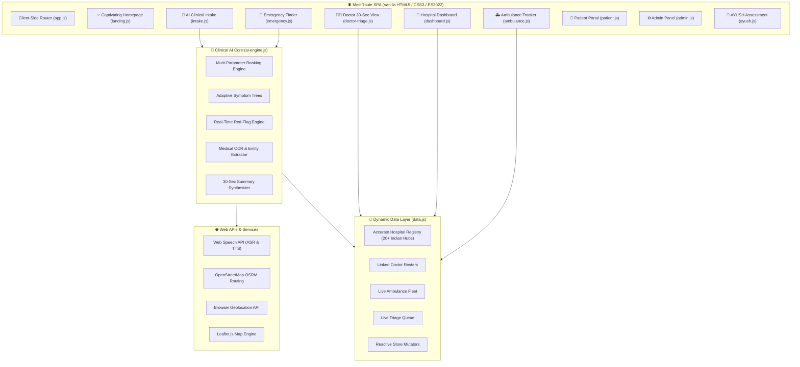

# 🏥 MediRoute — AI-Powered Emergency Healthcare & Clinical Triage Platform

[](https://github.com/KrishnaPanchal-Builds/MediRoute)
[](https://developer.mozilla.org/en-US/docs/Web/JavaScript)
[](https://developer.mozilla.org/en-US/docs/Web/API/Web_Speech_API)
[](https://project-osrm.org/)
[](LICENSE)

> **MediRoute** is an intelligent, real-time emergency healthcare and clinical intake platform designed to eliminate critical delays between medical emergencies and hospital admission. 
> Built for Smart India Hackathon (SIH PS 26047), it features **multilingual voice & touch intake**, **real-time red-flag triage detection**, **OSRM road routing**, **document OCR entity extraction with source traceability**, a **Doctor 30-Second Executive Review Portal**, **ABDM-compliant QR handoff**, and an **AYUSH assessment mode**.

---

## 🌟 Key Features

### 👤 1. Multilingual Voice & Touch AI Clinical Intake (`#intake`)
- **🌐 8 Indian Languages**: English, Hindi (हिंदी), Tamil (தமிழ்), Telugu (తెలుగు), Bengali (বাংলা), Marathi (मराठी), Gujarati (ગુજરાતી), Kannada (ಕನ್ನಡ) with audio prompt playback.
- **🗣️ Web Speech API (ASR & TTS)**: Real hands-free speech-to-text recognition and text-to-speech voice read-aloud guidance for elderly and low-literacy users.
- **🕺 Interactive Visual Body Map**: Clickable SVG body silhouette (Head, Chest, Abdomen, Back, Arms, Legs) that pre-selects chief complaints.
- **🌳 Adaptive Symptom Decision Trees**: Dynamic branching Trees (`Chest Pain`, `Headache`, `Fever`, `Abdominal Pain`, `Shortness of Breath`, `Dizziness`).
- **🚨 Real-Time Red-Flag Engine**: Scans inputs live for emergency signs (e.g. crushing chest pain, slurred speech, acute dyspnea). Automatically triggers red-alert banners and pushes case to priority Triage Queue.
- **📄 Camera Scan & Document OCR Engine**: Simulated medical OCR parser extracting diagnoses, active medications, dosages, and lab values from user-entered or scanned prescription texts.
- **📱 ABDM Patient QR Token**: Generates an encrypted Patient QR Code token containing digital intake payload for instant hospital registration.

### 👨‍⚕️ 2. Doctor 30-Second Review Portal (`#doctor-triage`)
- **⚡ 30-Second Executive Summary View**: Structured clinical summary displaying Chief Complaint, Red-Flag Alerts, Verified Allergies, Active Medications, Vitals, and Recent Labs.
- **🔍 AI Source & Evidence Mapping**: Hovering/clicking extracted medications or lab values displays an interactive bounding box highlight on the scanned document for 100% clinical traceability.
- **✏️ Physician Verification & ABDM Sync**: Editable chief complaint, clinical notes, diagnosis, and final disposition (Admit ICU, Ward, OPD, Discharge) with digital health record sync.

### 🚨 3. Emergency Hospital Finder (`#emergency`)
- **📍 Real Browser Geolocation**: Queries `navigator.geolocation` with accuracy feedback.
- **⌨️ Custom Location Text Search**: Parses typed addresses/localities (e.g., Saket, Dwarka, Andheri, Koramangala) and dynamically ranks hospitals via the AI engine.
- **🛣️ Real OSRM Road Routing**: Driving route geometry fetched live from OpenStreetMap OSRM API for top 3 ranked hospitals with color-coded polylines.
- **🏥 Hospital Details & Bed Booking**: View bed availability breakdown, facilities, doctors, and book emergency admissions with live booking IDs (`#MR-XXXX`).

### 🏥 4. Hospital Admin Dashboard (`#dashboard`)
- **➕ Hospital Registration Modal**: Multi-step registration for new emergency centers.
- **🔄 Live Status Update Panel**: Incremental bed updaters (`+`/`-`), department operational toggles (ER, OT, ICU, OPD, Lab, Radiology, Pharmacy), and quick announcement poster.
- **👨‍⚕️ Interactive Doctor Roster**: Searchable doctor roster with duty status toggles ('Available', 'In Surgery', 'On Break').

### 🚑 5. Ambulance Command Center (`#ambulance`)
- **📍 Fleet Map Tracking**: Moving SVG ambulance markers on Leaflet map with real-time ETA updates.
- **🚨 Fleet Dispatch Workflow**: Assigns ambulances to emergency locations, updates marker colors, and manages vehicle logs.

### 🌿 6. AYUSH Assessment & Integrative Healthcare (`#ayush`)
- **Dashavidha Pariksha**: 10-fold Ayurvedic assessment (Dushya, Desha, Bala, Kala, Anala/Agni, Prakriti, Vaya, Satva, Satmya, Ahara).
- **Ahara-Vihara Assessment**: Dietary preferences, sleep quality, physical exercise, and Dinacharya routine score.
- **Integrative Health Summary**: Combines allopathic history with Ayurvedic Prakriti & Agni status, providing Pathya-Apathya guidance and an exportable AYUSH Health Pass.

---

## 🏗️ Technical Architecture



---

## 🚀 How to Run Locally

Because MediRoute is built using zero-dependency modern vanilla web technologies, you can run it directly using any lightweight static web server:

### Option 1: Python Built-in Server (Recommended)
```bash
# Clone the repository
git clone https://github.com/KrishnaPanchal-Builds/MediRoute.git
cd MediRoute

# Run server on port 8080
python -m http.server 8080
```
Open **`http://localhost:8080`** in your browser.

### Option 2: Node npx serve
```bash
npx serve -l 8080
```

### Option 3: VS Code Live Server
Right click `index.html` in VS Code and select **"Open with Live Server"**.

---

## 📁 Repository Directory Structure

```text
MediRoute/
├── index.html              # Main SPA HTML Shell & Navigation
├── css/
│   ├── variables.css       # Design tokens (Colors, Typography, Glassmorphism)
│   ├── base.css            # Base resets, Animations & Layout Utility
│   ├── components.css      # UI Components (Cards, Modals, Toasts, Badges)
│   └── pages.css           # Page-specific responsive styles & AI widgets
├── js/
│   ├── app.js              # SPA Router, Theme Switcher, Notifications Dropdown
│   ├── data.js             # Dynamic Data Store, Mutators & Authentic Datasets
│   ├── ai-engine.js        # Multi-parameter Hospital AI & Clinical NLP Engine
│   ├── components.js       # Toast, Normalized Modal, SVG Charts & Leaflet Helpers
│   └── pages/
│       ├── landing.js       # Captivating Homepage, Hero Search & Workflow Sim
│       ├── emergency.js     # Emergency Hospital Finder & OSRM Routing
│       ├── dashboard.js     # Hospital Resource Dashboard & Registration
│       ├── ambulance.js     # Live Fleet Map & Dispatch Workflow
│       ├── patient.js       # Patient Digital Health Portal & Profile
│       ├── admin.js         # System Admin Panel & Provider Integrations
│       ├── intake.js        # Multilingual Voice AI Intake & ABDM QR Token
│       ├── doctor-triage.js # 👨‍⚕️ Doctor 30-Sec View & Evidence Mapper
│       └── ayush.js         # 🌿 AYUSH Dashavidha Pariksha Assessment
├── .gitignore              # Git ignore rules
└── README.md               # Repository Documentation
```

---

## 👥 Author & Repository

- **Repository**: [https://github.com/KrishnaPanchal-Builds/MediRoute](https://github.com/KrishnaPanchal-Builds/MediRoute)
- **Author**: Krishna Panchal (`KrishnaPanchal-Builds`)
- **Problem Statement**: SIH PS 26047 — Smart AI Clinical Intake, Priority Triage & Emergency Healthcare

---

© 2026 MediRoute. Built for Smart India Hackathon. All rights reserved.
